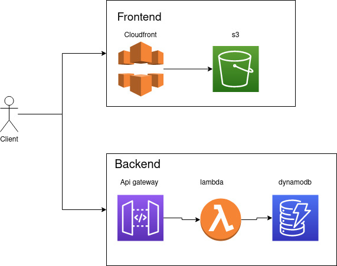

# chuck-noris-joke-generator

Simple serverless app that shows chuck norris joke on button click

# Installation instruction

## frontend
- refert to frontend/README.md

## backend
- refert to backend/dynamodb_joke_loader/README.md
- refert to backend/lambda/README.md

# Infrastructure Schema

# Live site demo

https://chuck.mayoche.info

# Documentation 

https://mayoche.gitbook.io/test
